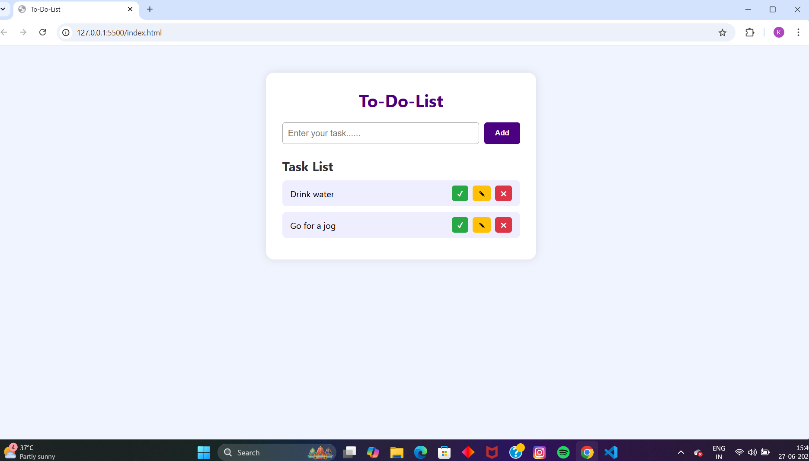

# 📝 To-Do List Web App

A simple and stylish To-Do List application built using **HTML**, **CSS**, and **JavaScript**.  
It allows you to add, complete, edit, and delete your daily tasks — all stored in your browser with **localStorage**.
## 🖼️ Preview

## 🔗 Live Demo

[Click here to view the website](https://kaviya-s-211.github.io/Simple-To-Do-List/)
